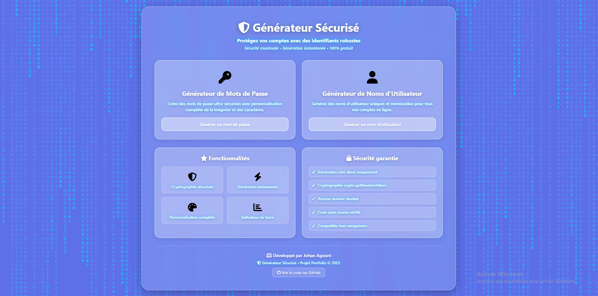
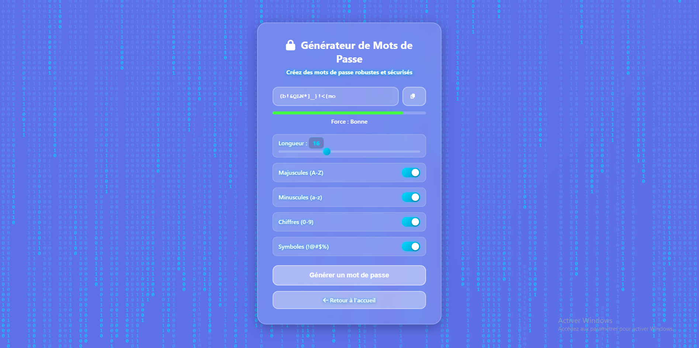
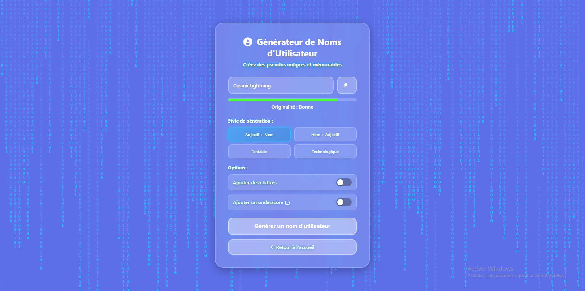

# 🔐 Générateur Sécurisé

Un générateur de mots de passe et de noms d'utilisateur sécurisés avec interface moderne et effet Matrix.


## 🚀 Démo en ligne

**[✨ Voir la démo](https://johan-agouni.github.io/secure-credentials-generator/)**

## 📸 Captures d'écran

### Page d'accueil

*Interface principale avec effet Matrix et choix du générateur*

### Générateur de mots de passe

*Génération sécurisée avec indicateur de force en temps réel*

### Générateur de pseudos

*Création de noms d'utilisateur uniques avec 4 styles différents*

---

## ✨ Fonctionnalités

### 🔑 Générateur de Mots de Passe
- **Cryptographie sécurisée** : Utilisation de `crypto.getRandomValues()` pour une génération aléatoire cryptographiquement forte
- **Personnalisation complète** : Longueur ajustable de 8 à 32 caractères
- **Options flexibles** : Choix parmi majuscules, minuscules, chiffres et symboles spéciaux
- **Indicateur de force** : Analyse en temps réel de la robustesse du mot de passe (Faible, Moyen, Bon, Très fort)
- **Copie en un clic** : Bouton de copie intégré dans le presse-papier

### 👤 Générateur de Noms d'Utilisateur
- **4 styles de génération** :
  - 🏆 **Adjectif + Nom** (ex: BravePhoenix, SilentWarrior)
  - 🎯 **Nom + Adjectif** (ex: PhoenixBrave, WarriorSilent)
  - ✨ **Fantaisie** (ex: Eldrithar, Mystralor)
  - 🤖 **Technologique** (ex: CyberNova, QuantumCore)
- **Options personnalisables** : Ajout de chiffres aléatoires et underscores
- **Indicateur d'originalité** : Évaluation de l'unicité du pseudo généré

### 🎨 Design & Interface
- **Effet Matrix animé** : Arrière-plan dynamique avec chute de caractères japonais
- **Glassmorphism** : Interface moderne avec effet de verre dépoli
- **Effet néon bleu** : Textes lumineux pour une meilleure lisibilité
- **Icônes Font Awesome** : Interface professionnelle et intuitive
- **100% Responsive** : S'adapte parfaitement aux mobiles, tablettes et ordinateurs

---

## 🛠️ Technologies utilisées

| Technologie | Utilisation |
|------------|-------------|
| **HTML5** | Structure sémantique des pages |
| **CSS3** | Animations, glassmorphism, effets néon |
| **JavaScript (Vanilla)** | Logique métier et génération sécurisée |
| **Crypto API** | Génération cryptographiquement sécurisée |
| **Font Awesome 6.5.1** | Bibliothèque d'icônes |

---

## 📦 Installation & Utilisation

### Option 1 : Cloner le repository

```bash
# Cloner le projet
git clone https://github.com/Johan-Agouni/secure-credentials-generator.git

# Accéder au dossier
cd secure-credentials-generator
```

### Option 2 : Lancer en local

Ouvrez simplement `index.html` dans votre navigateur, ou utilisez un serveur local :

```bash
# Avec Python 3
python -m http.server 8000

# Avec Node.js (http-server)
npx http-server

# Avec PHP
php -S localhost:8000
```

Puis accédez à `http://localhost:8000`

---

## 📁 Structure du projet

```
secure-credentials-generator/
│
├── index.html              # Page d'accueil
├── password.html           # Générateur de mots de passe
├── username.html           # Générateur de noms d'utilisateur
├── screenshots/            # Captures d'écran
│   ├── index_screen.png
│   ├── password_screen.png
│   └── username_screen.png
├── Image_acceuil.png       # Image de fond (optionnelle)
└── README.md               # Documentation
```

> **Note** : Les styles CSS et scripts JavaScript sont intégrés directement dans les fichiers HTML pour simplifier le déploiement.

---

## 🧮 Algorithmes & Sécurité

### Génération de mots de passe

L'application utilise **`crypto.getRandomValues()`**, l'API de cryptographie native du navigateur, qui garantit :
- Une entropie cryptographiquement sûre
- Une distribution uniforme des caractères
- L'absence de biais dans la génération

**Calcul de la force :**
```javascript
Entropie = log₂(ensemble_caractères^longueur)
```

| Force | Entropie | Exemple |
|-------|----------|---------|
| Faible | < 40 bits | `Pass123` |
| Moyen | 40-59 bits | `MyP@ssw0rd` |
| Fort | 60-79 bits | `kR9#mQ2$xL5&pN8` |
| Très fort | ≥ 80 bits | `@8Kz!mQ#7pL$9xR&2nW` |

### Garanties de sécurité

- ✅ **Génération côté client uniquement** : Aucune donnée n'est envoyée à un serveur
- ✅ **Crypto.getRandomValues()** : Utilisation de l'API de cryptographie du navigateur (CSPRNG)
- ✅ **Aucun stockage** : Les mots de passe ne sont jamais sauvegardés localement ou en ligne
- ✅ **Code open source** : Totalement transparent et vérifiable
- ✅ **Pas de dépendances externes** : JavaScript vanilla uniquement (hors Font Awesome pour les icônes)

---

## 💡 Guide d'utilisation

### Générer un mot de passe sécurisé

1. Accédez au générateur de mots de passe
2. Ajustez la longueur avec le curseur (8-32 caractères)
3. Cochez les types de caractères souhaités :
   - ✓ Majuscules (A-Z)
   - ✓ Minuscules (a-z)
   - ✓ Chiffres (0-9)
   - ✓ Symboles (!@#$%^&*)
4. Cliquez sur "Générer un mot de passe"
5. Vérifiez l'indicateur de force
6. Cliquez sur l'icône de copie pour copier dans le presse-papier

### Générer un nom d'utilisateur unique

1. Accédez au générateur de noms d'utilisateur
2. Sélectionnez un style :
   - **Adjectif + Nom** : Combinaisons descriptives
   - **Nom + Adjectif** : Ordre inversé
   - **Fantaisie** : Noms fantasy/médiévaux
   - **Technologique** : Noms cyber/futuristes
3. Activez les options si désiré :
   - Ajouter des chiffres aléatoires
   - Ajouter un underscore (_)
4. Cliquez sur "Générer un nom d'utilisateur"
5. Évaluez l'originalité affichée
6. Copiez le pseudo généré

---

## 🎯 Bonnes pratiques de sécurité

### Mots de passe

- 🔐 **Un mot de passe unique par compte** : Ne réutilisez jamais le même mot de passe
- 🔄 **Renouvellement régulier** : Changez vos mots de passe tous les 3-6 mois
- ✅ **Longueur minimale** : Privilégiez au moins 16 caractères pour une sécurité maximale
- 🛡️ **Authentification à deux facteurs** : Activez la 2FA quand c'est possible
- 💾 **Gestionnaire de mots de passe** : Utilisez un outil dédié (Bitwarden, 1Password, KeePass)

### Pseudonymes

- 🎭 **Évitez les informations personnelles** : Pas de prénom, nom, date de naissance
- 🔍 **Unicité** : Vérifiez que le pseudo n'est pas déjà pris ailleurs
- 🚫 **Pas de réutilisation** : Utilisez un pseudo différent pour chaque plateforme sensible

---

## 🎨 Contexte du projet

Ce projet a été réalisé dans le cadre de mon apprentissage du développement web sécurisé et fait partie de mon portfolio en tant que développeur web freelance.

**Objectifs pédagogiques :**
- Maîtriser JavaScript vanilla (sans framework)
- Implémenter les bonnes pratiques de sécurité (OWASP)
- Créer une interface moderne avec CSS avancé (glassmorphism, animations)
- Utiliser l'API de cryptographie du navigateur
- Concevoir une expérience utilisateur intuitive

---

## 🤝 Contribution

Les contributions sont les bienvenues ! Voici comment participer :

1. **Fork** le projet
2. Créez une branche pour votre fonctionnalité :
   ```bash
   git checkout -b feature/amelioration
   ```
3. Committez vos changements :
   ```bash
   git commit -m "Ajout : nouvelle fonctionnalité X"
   ```
4. Poussez vers votre branche :
   ```bash
   git push origin feature/amelioration
   ```
5. Ouvrez une **Pull Request**

### Idées de contribution

- 🌍 Traductions (anglais, espagnol, etc.)
- 🎨 Nouveaux thèmes de couleurs
- ✨ Styles de pseudos supplémentaires
- 🔧 Optimisations de code
- 📱 Améliorations responsive

---

## 📝 Roadmap / Améliorations futures

- [ ] Ajouter un historique temporaire des mots de passe générés (avec option d'effacement)
- [ ] Implémenter un générateur de phrases de passe (passphrase avec mots diceware)
- [ ] Créer 3-5 nouveaux styles de noms d'utilisateur (Gaming, Professionnel, Poétique)
- [ ] Développer une extension navigateur (Chrome/Firefox)
- [ ] Ajouter un mode sombre/clair personnalisable
- [ ] Support multilingue complet (EN, ES, DE, IT)
- [ ] Intégration d'un test de compromission via API Have I Been Pwned
- [ ] Export/import de paramètres utilisateur

---

## 📄 Licence

Ce projet est sous licence **MIT**. Voir le fichier [LICENSE](LICENSE) pour plus de détails.

Cela signifie que vous êtes libre de :
- ✅ Utiliser ce code à des fins personnelles ou commerciales
- ✅ Modifier et adapter le code
- ✅ Distribuer des copies
- ✅ Utiliser ce code dans vos propres projets

---

## 👨‍💻 Auteur

**Johan Agouni**  
Développeur Web Backend/Frontend | Spécialiste Sécurité Web

- 🌐 GitHub : [@Johan-Agouni](https://github.com/Johan-Agouni)
- 📧 Email : [agouni.johan@proton.me](mailto:agouni.johan@proton.me)
- 💼 **Disponible en freelance dès Avril 2025**

---

## 🌟 Remerciements

- [Font Awesome](https://fontawesome.com/) pour la bibliothèque d'icônes
- Inspiration du film *The Matrix* pour l'effet d'arrière-plan
- La communauté open source pour les retours et contributions

---

## 📊 Stats du projet


---

<div align="center">

### ⭐ Si ce projet vous a été utile, n'hésitez pas à lui donner une étoile ! ⭐

**[🔼 Retour en haut](#-générateur-sécurisé)**

</div>
